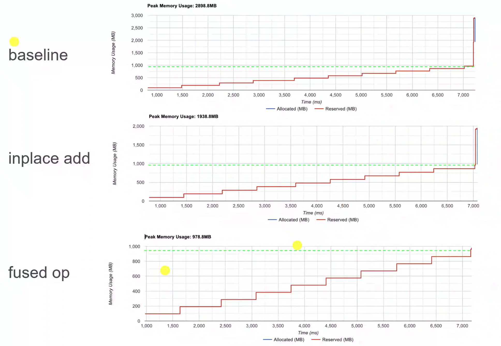
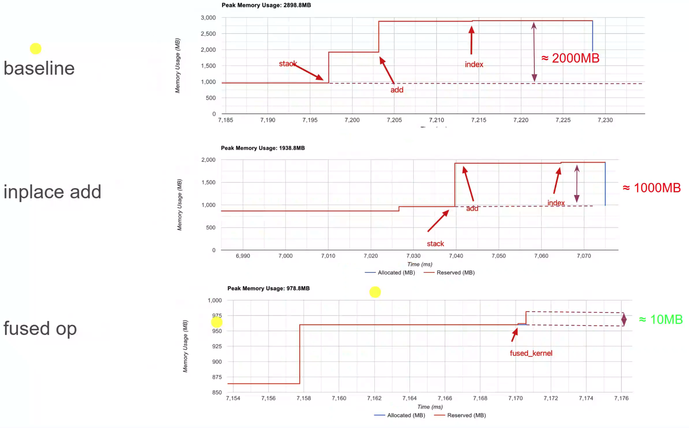
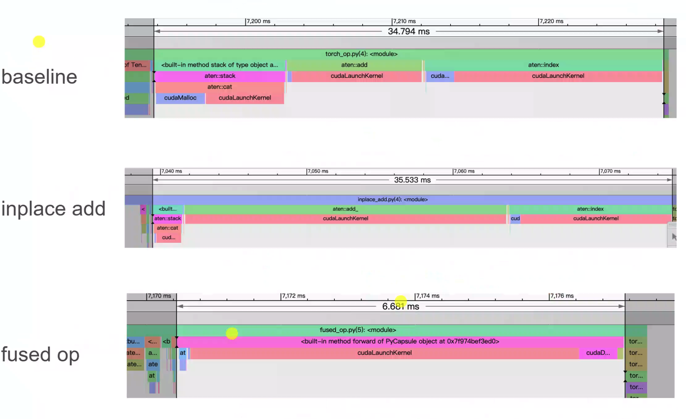

## An implementation for fused stack-add operator.
### How to build?
```bash
    pip install torch
```
```bash
    python setup.py
```

#### 2. How to use?
```bash
    import torch
    import fused_stack_add is 

    fused_result = fused_stack_add.forward([a, b, c, ...], add, index, stack_dim, index_dim)
```
`a, b, c...` is a list of tensors, who have the same shape `[B, L, D]`, the lenghth of the list is `V`, the datatype of tensor in the list is either **float32** or **half**.

`add` is a tensor of shape `[1, V, D]``, whose datatype is the same as input tensor.

`index` is a tensor with datatype **int** or **long**, whose dimesion <= 3,

`stack_dim` is the dim where **stack** op operate along,

`index_dim` is the dim where **index** op operate along.

#### 3. How to validate?
In fact, the fused_stack_add_index op does the same work as the following snippet in pytorch:
```python
    import torch
    stack_result = torch.stack([a, b, c, ...], dim=stack_dim)
    add_result = stack_result + add.unsqueeze(-2)
    final_result = add_result[:, :, index, :] ## suppose the index_dim = 2
```

Therefore, the correctness of the fused op can be directly validated by check its equality with `fianl_result`:
```python
    print(torch.all(finall_result == fused_result))
```

#### 4. Benchmark Result

- For memory footprint:






- For latency:




